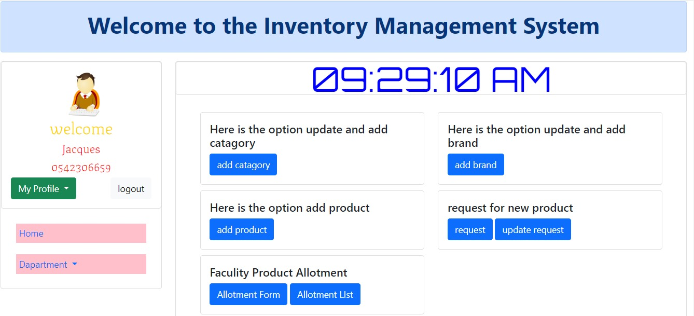
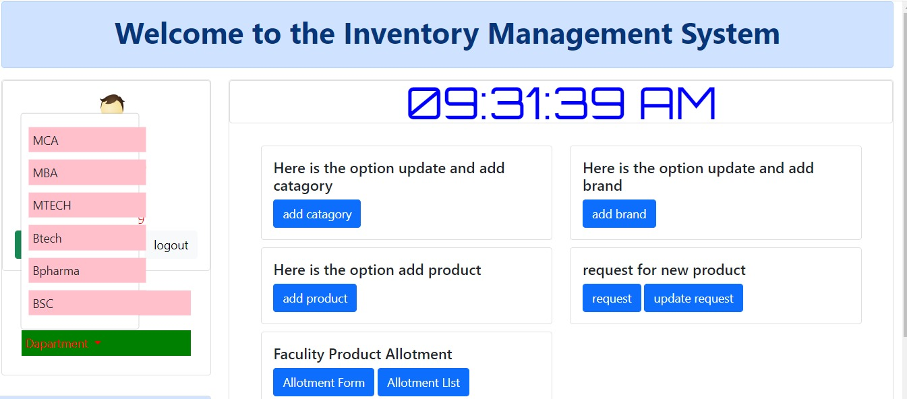
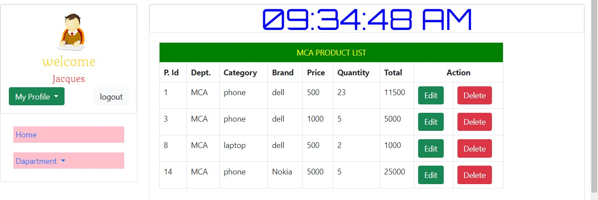

# JBee_Inventory-Management-System
## Table of Contents

- [Introduction](#introduction)
  - [Links](#links)
- [Inspiration 🌟](#inspiration-🌟)
- [Installation 🛠️](#installation-🛠️)
- [Usage 🚀](#usage-🚀)
  - [Home Page](#home-page)
  - [Search and Discover](#search-and-discover)
  - [User Interaction](#user-interaction)
- [Contributing 🤝](#contributing-🤝)
- [Challenges 😅](#challenges-😅)
  - [Technical Challenges](#technical-challenges)
  - [Non-Technical Challenges](#non-technical-challenges)
- [Progress Assessment 📈](#progress-assessment-📈)
  - [Completed as Planned](#completed-as-planned)
  - [Incomplete Aspects](#incomplete-aspects)
- [Next Iteration Vision 🌱](#next-iteration-vision-🌱)
- [Related Projects 🔗](#related-projects-🔗)
- [Licensing 📜](#licensing-📜)


## Introduction

Welcome to the Departmental/Institutional Inventory Management System! This system was designed to simplify inventory management for organizations, especially educational institutions. It manages supplies, equipment, or products for various departments, such as MCA, MBA, and BTech. Key features include adding and managing product categories and brands, submitting and handling product requests, and managing product allotment to faculty members or departments. The goal is to create a streamlined, user-friendly platform for tracking inventory and improving department transparency.


##  Links


-	[Jacques Appiagyei](https://www.linkedin.com/in/jacques-appiagyei-8b49b119b/)
-	[Bernard Donkor](https://www.linkedin.com/in/bernard-donkor-829129314/)

## Installation
To run this project locally, follow these steps:
1.	 **Clone the Repository:**
    ```bash
    git clone https://github.com/bernardig/JBee_Inventory-Management-System.git
    ```
2.	 **Navigate to the Project Directory: **
    ```bash
    cd JBee_Inventory-Management-System
    ```
## Usage

1.	 **Home Page: **
On page load, you'll be greeted with a large cover image, the project name, and a brief description. Navigation elements in the header bar allow you to access different sections like "Login" and "Departs". A button labeled "Learn more" navigates you to the main application.


3.	**Search and Discover: **
Use the search bar and filters to find departments and programs. 

4.	**User Interaction: **Create an account at user dashboard, add categories and brands, and allotment tracking.


## Contributing

We welcome contributions to improve this project. To contribute:

1. Fork the repository.
2. Create a new branch (`git checkout -b feature-branch`).
3. Commit your changes (`git commit -m 'Add new feature'`).
4. Push to the branch (`git push origin feature-branch`).
5. Open a Pull Request.

Please read our [Contributing Guide](CONTRIBUTING.md) for more details.
## Challenges 😅

### Technical Challenges

Implementing the product allotment rules for faculty and ensuring that user sessions were secure and efficient were more complex than we initially anticipated. Additionally, performance optimization when managing larger product inventories will be important as the system scales, and this is an area where improvements can be made.

### Non-Technical Challenges

The most difficult non-technical challenge was coordinating with a remote team. Time zone differences and varying schedules made communication and collaboration challenging. We adapted by setting up regular check-ins and using collaboration tools like Discord and Trello to stay organized and on track.

## Progress Assessment 📈

### Completed as Planned

- Development of core features: user dashboard, user accounts, Add categories and brands, Add new products, Allotment Tracking, and User Requests features.
- Successful deployment of the website.
- User testing and feedback collection.

### Incomplete Aspects

- Advanced community features like event planning and user-to-user messaging.
- Integration of more comprehensive location data and user-generated content.
- Additional testing and optimization for performance improvements.

## Next Iteration Vision 🌱

For the next iteration, I envision incorporating more advanced community features, such as event planning and user-to-user messaging. Enhancing the location data with user-generated content and improving the mobile experience are also top priorities. Further optimization for performance and scalability will ensure that the platform can handle increased traffic and provide a seamless user experience.


## Related Projects

Here are some related projects that inspired us:
-	[Inventory Management System]( https://github.com/fajarghifar/inventory-management-system)

## Licensing

This project is licensed under the MIT License. See the [LICENSE](LICENSE)file for more information.

---

Thank you for visiting the Global Wild Swimming and Camping Website. We hope you find it a valuable resource for your outdoor adventures!

